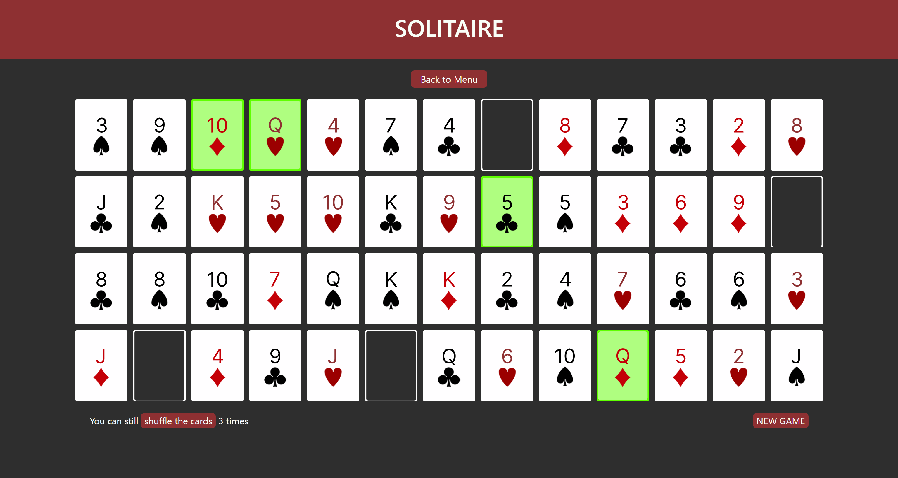

# ♠️ Solitaire Game

Welcome to my web-based **Solitaire Game**! This is a fun and interactive version of the classic card game built using HTML, CSS, and Python.

## 🚀 Getting Started

To run the game locally, follow these steps:

1. Clone the repository:

   git clone [https://github.com/lpostiguy/solitaire-game.git ](https://github.com/lpostiguy/solitaire-game.git)
   cd solitaire-game

2. Open the Project in VS Code  
   Make sure you have [Visual Studio Code](https://code.visualstudio.com/) installed.

3. Open the `landingExperience.html` file in VS Code.

4. Ensure the **Live Server** extension is installed.  
   If not, you can install it from the Extensions tab (search for "Live Server" by Ritwick Dey).

5. Click the **"Go Live"** button in the bottom right corner of VS Code.

6. Your browser will open with the game running!

## 🕹️ How to Play

- Arrange cards in descending order and alternating colors.
- Move cards to the foundation piles in order from Ace to King, grouped by suit.
- Use empty tableau spaces strategically to organize your cards.
- Win by moving all cards to the foundation piles.

## 🛠️ Built With

- HTML5
- CSS3
- Python3

## 📄 License

This project is licensed under the MIT License.

---

Enjoy playing Solitaire! ♣️♦️♥️♠️
